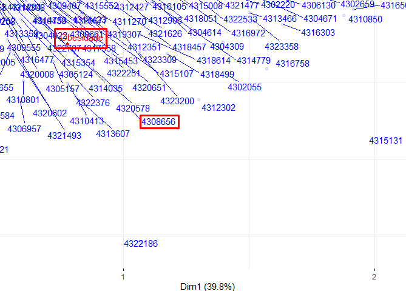
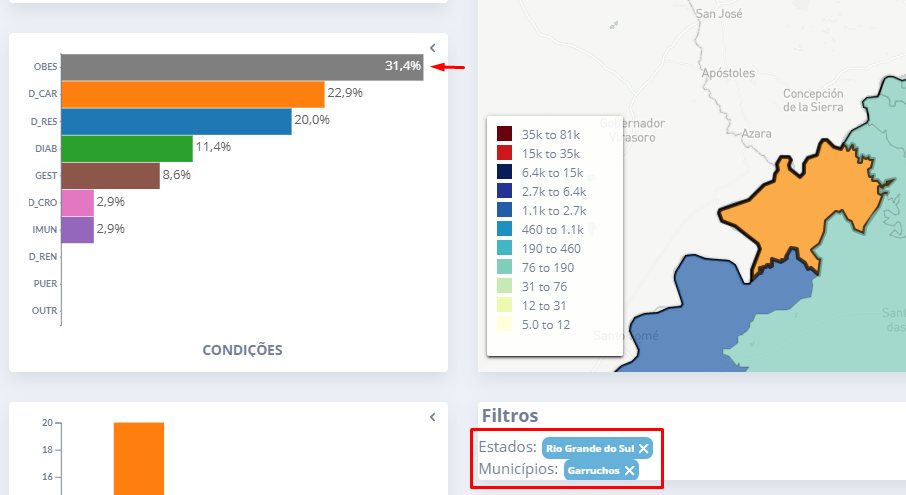

```{r set-options, echo=FALSE, cache=FALSE}
if (knitr::is_latex_output()) {
  options(width = 70)
}
```

## Tratamento previo

### Livrarias

```{r}
library(tidyverse)
library(FactoMineR)
library(factoextra)
library(gplots)
library(geobr)
library(ggplot2)
library(sf)
library(dplyr)
library(crul)
library(streamgraph)
```

### Carregando dados

Carregando desde o RData que foi salvo. Selecionando só dados do estado RS. E deletados os fatores que a gente não vai usa como os códigos IBGE dos municipios dos outros estados.

```{r}
load("output/qdscovid_conditions.Rda")
dados = dados[dados$estadoIBGE == '43',]
dados$estadoIBGE = factor(dados$estadoIBGE)
dados$municipioIBGE = factor(dados$municipioIBGE)
dados$condicoes = factor(dados$condicoes)
head(dados)
```

```{r}
summary(dados)
```

## Stacked time series

As duas datas consistentes são analisadas.

### Data de inicio de sintomas

Criada uma tabela de contingencia da data com as condições e depois adiconada a data como fila.

```{r}
ts_dataInicioSintomas = table(dados$dataInicioSintomas, dados$condicoes)
ts_dataInicioSintomas = as.data.frame.matrix(ts_dataInicioSintomas)

dataInicioSintomas = rownames(ts_dataInicioSintomas)
ts_dataInicioSintomas = cbind(dataInicioSintomas, ts_dataInicioSintomas)
```

E com o esse dataframe é desenhado o stacked time series.

```{r}
ts_dataInicioSintomas %>% 
  mutate(dataInicioSintomas = as.Date(dataInicioSintomas)) %>% 
  gather(condicoes, value, levels(dados$condicoes)) %>% 
  ggplot(aes(x = dataInicioSintomas, y = value, fill = condicoes)) +
  geom_area()
```

### Data da notificação

Criada uma tabela de contingencia da data com as condições e depois adicionada a data como fila.

```{r}
ts_dataNotificacao = table(dados$dataNotificacao, dados$condicoes)
ts_dataNotificacao = as.data.frame.matrix(ts_dataNotificacao)

dataNotificacao = rownames(ts_dataNotificacao)
ts_dataNotificacao = cbind(dataNotificacao, ts_dataNotificacao)
```

E com o esse dataframe é desenhado o stacked time series.

```{r}
ts_dataNotificacao %>% 
  mutate(dataNotificacao = as.Date(dataNotificacao)) %>% 
  gather(condicoes, value, levels(dados$condicoes)) %>% 
  ggplot(aes(x = dataNotificacao, y = value, fill = condicoes)) +
  geom_area()
```

## Stream Graph

As duas datas consistentes são analisadas.

### Data de inicio de sintomas

Os dados que vamos usar são as contagens de condições por data tanto desde o inicio da pandemia como da última onda.

```{r}
df_dataInicioSintomas = data.frame(
  dataInicioSintomas = dados$dataInicioSintomas,
  condicoes = as.character(dados$condicoes),
  value = rep(0.5, dim(dados)[1])
)

df_dataInicioSintomas = dados %>% group_by(dataInicioSintomas, condicoes) %>% summarise(n = n())

df_dataInicioSintomas_last_wave = df_dataInicioSintomas[df_dataInicioSintomas$dataInicioSintomas >= "2021-01-01" & df_dataInicioSintomas$dataInicioSintomas <= "2022-01-01",]
```

Stream graph com as datas desde o inicio da pandemia e com uma interpolação cardinal e sem normalização:

```{r}
streamgraph(df_dataInicioSintomas, key = "condicoes", value = "n", date = "dataInicioSintomas",interpolate="cardinal", offset = "silhouette ", interactive = TRUE) %>% 
  sg_fill_brewer("Paired") %>%
  sg_legend(show = TRUE, label = "Condições")
```

Stream graph visualizado como normalized stacked bar chart da última onda:

```{r}
streamgraph(df_dataInicioSintomas_last_wave, key = "condicoes", value = "n", date = "dataInicioSintomas",interpolate="step", offset = "expand", interactive = TRUE) %>% 
  sg_fill_brewer("Paired") %>%
  sg_legend(show = TRUE, label = "Condições")
```

### Data da notificação

Os dados que vamos usar são as contagens de condições por data tanto desde o inicio da pandemia como da última onda.

```{r}
df_dataNotificacao = data.frame(
  dataNotificacao = dados$dataNotificacao,
  condicoes = as.character(dados$condicoes),
  value = rep(0.5, dim(dados)[1])
)

df_dataNotificacao = dados %>% group_by(dataNotificacao, condicoes) %>% summarise(n = n())

df_dataNotificacao_last_wave = df_dataNotificacao[df_dataNotificacao$dataNotificacao >= "2021-01-01" & df_dataNotificacao$dataNotificacao <= "2022-01-01",]
```

Stream graph com as datas desde o inicio da pandemia e com uma interpolação cardinal e sem normalização:

```{r}
streamgraph(df_dataNotificacao, key = "condicoes", value = "n", date = "dataNotificacao",interpolate="cardinal", offset = "silhouette ", interactive = TRUE) %>% 
  sg_fill_brewer("Paired") %>%
  sg_legend(show = TRUE, label = "Condições")
```

Stream graph visualizado como normalized stacked bar chart da última onda:

```{r}
streamgraph(df_dataNotificacao_last_wave, key = "condicoes", value = "n", date = "dataNotificacao",interpolate="step", offset = "expand", interactive = TRUE) %>% 
  sg_fill_brewer("Paired") %>%
  sg_legend(show = TRUE, label = "Condições")
```

## Mapa com coloração predominante

Primeiro, criada uma tabela de contingencia dos municípios e das condições:

```{r}
contingency_table = table(dados$municipioIBGE, dados$condicoes)
head(contingency_table)
```

Desde esta tabela é criado um dataframe dos municípios com a condição predominante:

```{r}
contingency_table = as.data.frame.matrix(contingency_table)

code_muni = rownames(contingency_table)
condicoes = colnames(contingency_table)[apply(contingency_table,1,which.max)]

bestCondition = cbind(code_muni, condicoes)
bestCondition = as.data.frame(bestCondition)
bestCondition$code_muni = as.numeric(bestCondition$code_muni)

head(bestCondition)
```

Logo, são baixados os mapas dos municípios e é feito um merge com a tabela gerada anteriormente:

```{r, results='hide'}
all_muni = read_municipality(code_muni = "RS", year= 2010)
```

```{r}
all_muni = merge(x = all_muni, y = bestCondition, by = "code_muni", all.x = TRUE)

head(all_muni)
```

Finalmente, é gerado o mapa com condição predominante:

```{r}
no_axis = theme(axis.title=element_blank(),
                axis.text=element_blank(),
                axis.ticks=element_blank())

ggplot() +
  geom_sf(data=all_muni, aes(fill=condicoes), color="#2D3E50", size=.15, show.legend = TRUE) +
  labs(subtitle="Municipalities of RS", size=8) +
  theme_minimal() +
  no_axis
```

## Redução dimensional

Ao pesquisar métodos de redução dimensional com dimensões categórias foi achado a seguinte informação: [5 Must-Know Dimensionality Reduction Techniques via Prince](https://towardsdatascience.com/5-must-know-dimensionality-reduction-techniques-via-prince-e6ffb27e55d1)

Desses métodos o melhor que se ajusta a nossos dados e às coisas que a gente mostra é o Correspondece Analysis (CA) technique. Este método é baseado na [tabela de consistencia](https://en.wikipedia.org/wiki/Contingency_table) que é uma matrix de frequencias de duas dimensões. Desde esta tabela é possível gerar o gráfico de redução dimensional.

Esta seção, na parte de código, é baseada na seguinte guia: [CA - Correspondence Analysis in R: Essentials](http://www.sthda.com/english/articles/31-principal-component-methods-in-r-practical-guide/113-ca-correspondence-analysis-in-r-essentials/) 

Primeiro, é criada a tabela de contingencia com as dimensões dos municipios e as condições:

```{r}
contingency_table = table(dados$municipioIBGE, dados$condicoes)
head(contingency_table, n = 10)
```

Logo, é achado o Chi-squared e dá pra ver que os dados tem significativa dependencia entre as dimensões:

```{r}
chisq.test(contingency_table)
```

Depois, é calculado o CA:

```{r}
res.ca = CA(as.data.frame.matrix(contingency_table), graph = FALSE)
```

E finalmente são desenhadas as dimensões no gráfico. Dá pra ver os municípios são azuis e as condições vermelhas. Os códigos dos municípios foram ocultados para mostrar bem o gráfico:

```{r}
options(ggrepel.max.overlaps = Inf)
fviz_ca_biplot(res.ca, map = "symbiplot", repel = TRUE, label = "col", alpha.row = 0.1, title = "Municípios e condições")
```

Com esse gráfico foi feito um pequeno experimento. É pegado um município que esteja relacionado só com a obesidade:



E no QDSCOVID é selecionado só esse município (Garruchos, 4308656) e com isto dá pra ver que a obesidade é o valor predominante:




